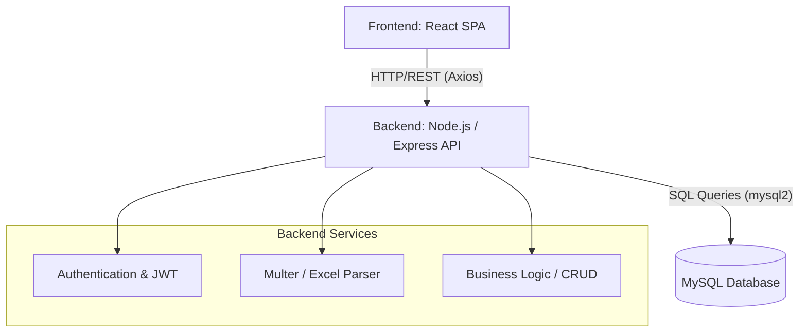

# Construction Project Management System
## End-to-End IT Technical Documentation

> [!NOTE]
> This document serves as the primary technical reference for the Construction Project Management System. It outlines the architecture, technology stack, database design, user roles, and core modules.

---

## 1. Project Overview
The Construction Project Management System is a comprehensive web-based platform designed to manage and monitor construction projects. It tracks project progress, workforce (manpower), machinery usage, material consumption, finances (investors, loans, expenses, billing), and includes extensive role-based access control (RBAC). An integrated Excel upload module allows for seamless bulk data ingestion.

---

## 2. Technology Stack

### Frontend (Client-Side)
- **Framework:** React.js (v19)
- **Routing:** React Router v7
- **Styling:** Custom CSS (with modern aesthetic considerations, toast notifications via `react-hot-toast`)
- **Charting:** Recharts
- **HTTP Client:** Axios
- **Build Tool:** Create React App (react-scripts)

### Backend (Server-Side)
- **Runtime:** Node.js
- **Framework:** Express.js (v5.2.1)
- **Authentication:** JSON Web Tokens (JWT) & bcryptjs (password hashing)
- **File Uploads:** Multer
- **Data Processing:** xlsx (Excel parsing), Form-Data
- **Database Driver:** mysql2

### Database
- **Engine:** MySQL
- **Key Features:** Relational schema with Foreign Keys, Cascading Deletes, and Unique constraints for collision prevention during bulk uploads.

---

## 3. System Architecture

---

## 4. Role-Based Access Control (RBAC)
The platform enforces strict role-based authorization to ensure data security and operational integrity:

| Role | Access Level | Description |
| :--- | :--- | :--- |
| **Admin** | Full Access | Can manage users, view audit logs, access admin panels, and has all permissions of Managers and Engineers. |
| **Manager** | High Access | Can manage project teams, investors, loans, expenses, billing, budget comparisons, and excel imports. |
| **Engineer** | Operational Access | Focused on field data: materials, machines, workers, and daily usage logs (material/manpower/machine usage). |

---

## 5. Core Modules & Features

### 5.1 Project & Resource Management
- **Projects:** Creation, tracking, detailed views, and progress monitoring.
- **Project Team:** Assignment of roles and users to specific projects.
- **Resources:** Management of Materials, Machines, and Workers.
- **Usage Logs:** Daily tracking of Material Usage, Machine Usage, and Manpower Usage.

### 5.2 Financial Module
- **Investors & Financiers:** Tracking capital sources.
- **Investments & Loans:** Managing funds received and loans taken.
- **Interest Payments:** Scheduling and recording interest payments.
- **Expenses & Categories:** Tracking project expenditures.
- **Billing:** Generating and managing client bills.
- **Budget Comparison:** Comparing projected budgets against actual expenses.

### 5.3 System Administration
- **User Management:** Creating users, resetting passwords, and assigning roles.
- **Audit Logs:** Tracking system activities and user actions.
- **Recycle Bin:** Soft-deleted records management and restoration.
- **Alerts:** System-wide notifications and alerts.

### 5.4 Excel Import Module
An intelligent data ingestion engine built to avoid data collisions.
- **Tracking:** Uses `excel_imports` to monitor file status (PENDING, PROCESSING, COMPLETED, FAILED).
- **Logging:** Uses `excel_import_logs` to capture row-by-row validation errors.
- **Collision Strategy:** Utilizes MySQL `ON DUPLICATE KEY UPDATE` (Upsert) to merge existing records safely based on unique identifiers.

---

## 6. API Endpoints Overview

The backend exposes RESTful endpoints grouped by domain. All endpoints (except public auth routes) require a valid JWT bearer token.

| Route Prefix | Purpose |
| :--- | :--- |
| `/api/auth` | Login and token generation (Public). |
| `/api/users` | User CRUD operations. |
| `/api/projects` | Project creation, retrieval, updates, and deletion. |
| `/api/materials` | Material catalog management. |
| `/api/material-usage`| Logging material consumption per project. |
| `/api/investors` | Financial investor records. |
| `/api/billing` | Client invoicing and billing records. |
| `/api/import` | Excel file upload and processing endpoints. |
| `/api/audit-log` | System audit trail retrieval. |

> [!TIP]
> The `/api/health` endpoint can be used by load balancers or monitoring tools to verify the backend status.

---

## 7. Security Best Practices Implemented

1. **Authentication:** Stateless JWT-based authentication. Passwords are never stored in plaintext (bcrypt hashing).
2. **Authorization:** Middleware checks (`authMiddleware`) ensure routes are protected. The frontend also dynamically hides routes using a `<ProtectedRoute>` wrapper based on user roles.
3. **Data Integrity:** The MySQL database uses robust foreign key constraints. The Excel importer validates rows before insertion to prevent corrupt data.
4. **CORS:** Cross-Origin Resource Sharing is explicitly configured on the Express backend.

---

## 8. Installation & Deployment Guide

### Prerequisites
- Node.js (v18+)
- MySQL (v8.0+)
- npm or yarn

### 8.1 Database Setup
1. Create a new MySQL database: `CREATE DATABASE construction_db;`
2. Import the provided SQL schemas (`constructiondata.sql` and `material_usage.sql`).

### 8.2 Backend Setup
1. Navigate to the backend directory: `cd d:\fundMonitoringTool1s\backend`
2. Install dependencies: `npm install`
3. Configure environment variables (e.g., `.env` file containing `DB_HOST`, `DB_USER`, `DB_PASS`, `DB_NAME`, `JWT_SECRET`, `PORT`).
4. Start the server: `npm run dev` (Runs on `http://localhost:3001` by default).

### 8.3 Frontend Setup
1. Navigate to the frontend directory: `cd d:\fundMonitoringTool1s\frontend`
2. Install dependencies: `npm install`
3. Start the React development server: `npm start` (Runs on `http://localhost:3000` by default).

> [!IMPORTANT]
> For production deployment, use `npm run build` in the frontend directory to generate static files, and serve them via a web server like Nginx or configure Express to serve the static build folder. Ensure environment variables are securely set in the production environment.
