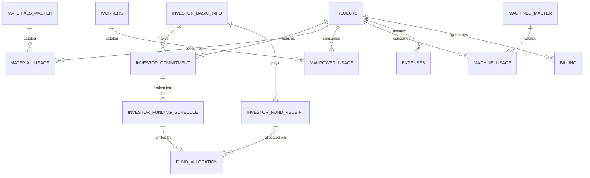
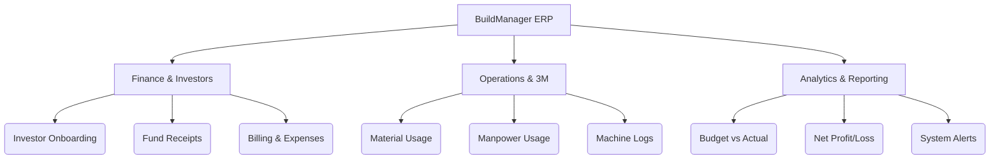
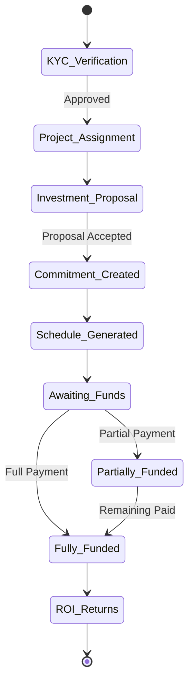
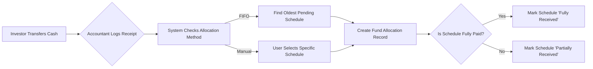
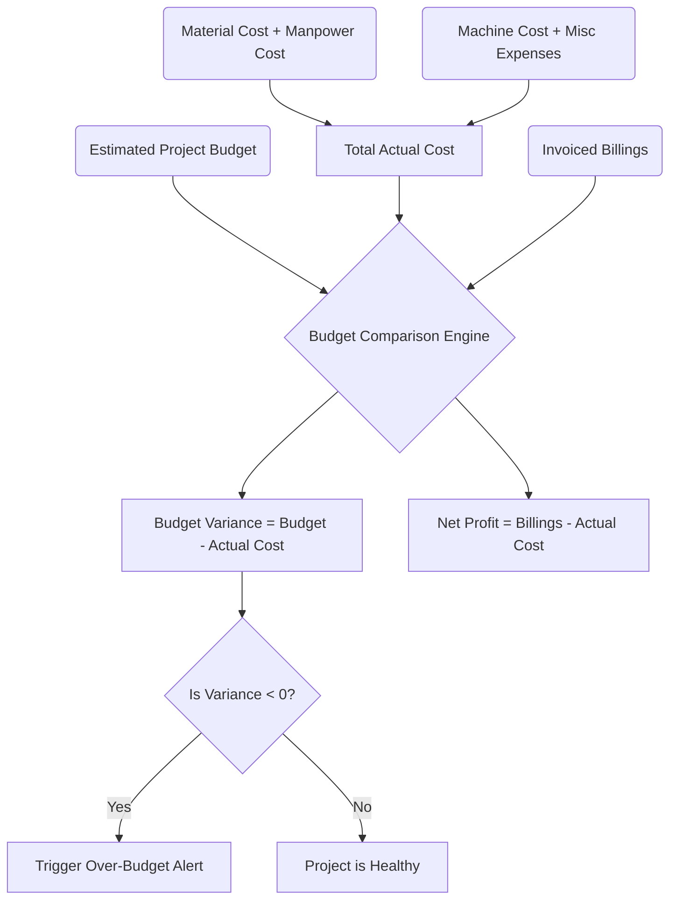

# BuildManager: Construction ERP System
## Comprehensive Business Flow & Architecture Document

---

## 1. EXECUTIVE SUMMARY

### The Real-World Problem
In the construction industry, profit margins are notoriously thin, and projects are highly susceptible to cost overruns and delays. Most construction companies struggle because their data is siloed: site engineers track material usage on paper, accountants track expenses in Excel, and management tracks investor commitments in separate systems. This disconnect leads to delayed billing, undetected budget overruns, and mismanaged investor expectations. 

### The Solution
This software acts as a unified **Construction Enterprise Resource Planning (ERP)** system. It bridges the gap between field operations (tracking Materials, Manpower, and Machines—the "3Ms") and back-office finance (managing Investor funds, Billing, and Expenses). 

### The Users
- **Admin:** Overall system owner. Manages global configurations, user roles, system health, and high-level financial tracking.
- **Project Manager:** Oversees specific projects, monitors the budget vs. actual cost variances, and manages team allocations.
- **Site Engineer:** Operates on the ground. Logs daily material usage, worker attendance, and machine hours.
- **Finance/Accountant:** Manages billing, records project expenses, tracks investor fund receipts, and monitors loan interest payments.

### Business Value Delivered
- **Real-Time Financial Health:** Instantly see if a project is bleeding money by comparing total actual costs against the estimated budget and billed revenue.
- **Investor Transparency:** Automates the lifecycle of capital from pitch to funding schedule to ROI, ensuring investors are billed for installments on time.
- **Operational Accountability:** Every bag of cement, hour of labor, and machine rental is tracked and directly attributed to a project's cost center.

---

## 2. END-TO-END BUSINESS FLOW

The system follows a logical progression mirroring the real-world lifecycle of a construction project.

1. **Project Initiation:** A new project is created with an estimated budget (Billable Amount).
   * **Value:** Establishes the financial baseline.
   * **Input:** Project details, start/end dates, budget. **Output:** `projects` record.

2. **Investor Onboarding & Capital Raise:** An investor is onboarded, assigned to the project, and proposes an investment. The proposal is accepted, creating a firm financial commitment.
   * **Value:** Secures the capital required to build the project.
   * **Input:** KYC details, investment amount. **Output:** `investor_basic_info`, `investor_commitment`.

3. **Funding Schedule Generation:** The commitment is broken down into monthly installments.
   * **Value:** Provides a predictable cash flow pipeline.
   * **Input:** Number of installments. **Output:** `investor_funding_schedule`.

4. **Fund Tracking (Cash In):** As the investor transfers money (e.g., via Bank Transfer), receipts are recorded and allocated against pending schedules (FIFO).
   * **Value:** Reconciles expected capital with actual cash in bank.
   * **Input:** Receipt amount, date. **Output:** `investor_fund_receipt`, `fund_allocation`.

5. **Operational Execution (The 3Ms):** Site engineers log daily usage of Materials, Manpower, and Machines.
   * **Value:** Accurately calculates the direct cost of construction.
   * **Input:** Daily logs (e.g., 50 bags of cement, 10 workers for 8 hours). **Output:** `material_usage`, `manpower_usage`, `machine_usage`.

6. **Expense Tracking (Cash Out):** Accountants log overheads, permits, and miscellaneous costs not covered by direct 3M tracking.
   * **Value:** Captures indirect costs to ensure the true P&L is accurate.
   * **Input:** Vendor invoices, overhead costs. **Output:** `expenses`.

7. **Billing & Invoicing (Revenue):** The company bills the end-client or records value created. 
   * **Value:** Tracks accounts receivable and recognizes revenue.
   * **Input:** Invoice amount, due date. **Output:** `billing`.

8. **Budget Analysis & P&L Calculation:** The system aggregates all costs (3M + Expenses) and subtracts them from Revenue (Billing) to show real-time Net Profit/Loss.
   * **Value:** The ultimate metric of success for the project.
   * **Output:** Dashboard reports and analytics.

---

## 3. SIDEBAR MODULE ANALYSIS

### Dashboard & Analytics
- **Module Purpose:** Provides a 30,000-foot view of the company.
- **Business Problem Solved:** Eliminates the need to wait for month-end reports to know if the company is profitable.
- **Inputs:** Read-only module aggregating data from all operational and financial tables.
- **Outputs:** Cards showing total projects, active workers, total expenses, and net profit.
- **Connected Modules:** End-of-the-line reporting module.

### Resources (3M) & Usage Tracking
- **Module Purpose:** Manage the master catalogs for Materials, Machines, and Workers, and track their daily consumption.
- **Business Problem Solved:** Prevents material theft, ghost workers, and idle machine rentals.
- **Who Uses It:** Site Engineers and Managers.
- **Inputs:** Catalog entries (e.g., "Cement - ₹400/bag") and Daily logs (e.g., "Used 100 bags on Project A").
- **Database Impact:** Updates `materials_master`, `material_usage`, `manpower_usage`, `machine_usage`.
- **Real World Example:** A site engineer logs that an excavator was rented for 8 hours at ₹2,000/hr. The system instantly adds ₹16,000 to the Actual Cost of "Green Valley Apartments".

### Investor Onboarding
- **Module Purpose:** A 4-step wizard to register investors, assign them to projects, define their commitment, and generate payment schedules.
- **Business Problem Solved:** Formalizes the capital-raising process and automates schedule reminders.
- **Inputs:** Investor details, proposed investment amount (e.g., ₹50,000,000), Expected ROI (e.g., 15%).
- **Outputs:** A legally trackable commitment and a month-by-month payment schedule.
- **Real World Example:** Mr. Sharma commits ₹1 Crore to a project. The system automatically creates a schedule of 10 monthly installments of ₹10 Lakhs each.

### Fund Tracking
- **Module Purpose:** Accounts Receivable for investor capital. 
- **Business Problem Solved:** Reconciles bank statements with expected investor installments. Uses a FIFO algorithm to automatically close out older pending installments when a lump sum is received.
- **Inputs:** Bank receipt details (Amount, Date, UTR number).
- **Database Impact:** Creates `investor_fund_receipt` and updates `investor_funding_schedule` statuses to 'Partially Received' or 'Fully Received'.

### Expenses & Billing
- **Module Purpose:** Tracks indirect cash outflows (Expenses) and revenue inflows (Billing/Invoicing).
- **Business Problem Solved:** Ensures no cost goes unrecorded and clients are billed on time.
- **Real World Example:** The company pays ₹50,000 for site permits (Expense). They then generate a Milestone 1 invoice for ₹20 Lakhs to the client (Billing).

### Budget Analysis
- **Module Purpose:** The financial heartbeat of the project. Compares Estimated Budget vs. Actual Cost vs. Billed Revenue.
- **Business Problem Solved:** Early detection of budget overruns.
- **Calculation:** `Budget Variance = Budget - Actual Cost`. `Profit = Billed - Actual Cost`.

---

## 4. USER JOURNEY ANALYSIS

### Admin Daily Workflow
1. Logs into the system.
2. Checks the **Dashboard** and **Alerts** for overdue bills, delayed projects, or budget overruns.
3. Reviews the **Budget Analysis** module to ensure company-wide profitability is intact.
4. Manages user access, audits the **Audit Log** for suspicious activities, and checks the **Recycle Bin** for accidental deletions.

### Project Manager Daily Workflow
1. Navigates to **Projects** and selects their assigned project.
2. Reviews the **Project Progress** tracking.
3. Checks **Usage Tracking** to verify the Site Engineer correctly logged yesterday's labor and material consumption.
4. Reviews the project-specific **Budget Comparison** to ensure they haven't exceeded the allocation for the month.

### Investor Portal Workflow
*(Conceptual, based on Investor Dashboard logic)*
1. Investor logs into a restricted view.
2. Views the **Investor Dashboard** to see `Total Committed: ₹50 L`, `Total Funded: ₹20 L`, and `Outstanding Balance: ₹30 L`.
3. Reviews **Upcoming Obligations** to see that Installment #3 for ₹5 L is due next week.
4. Tracks the overall progress of the projects they have funded.

---

## 5. FINANCIAL FLOW ANALYSIS

The movement of money in this system is strictly tracked across two distinct pipelines: **Capital (Funding)** and **Operations (P&L)**.

### Pipeline 1: Capital Raise (The Investor Flow)
`Investor Commitment` -> `Funding Schedule` -> `Fund Receipt` -> `Allocation`
- **Trigger:** Investor signs a term sheet (Commitment).
- **Movement:** Capital moves from the investor's bank to the company's bank (Recorded via Fund Tracking).
- **System Action:** A `FIFO` allocation logic applies the received cash to the oldest pending `Funding Schedule`.

### Pipeline 2: Operational Execution (The Profit & Loss Flow)
`Estimated Budget` -> `Accrued Costs (3M + Expenses)` -> `Billing Revenue` -> `Net Profit`
- **Trigger:** Daily construction activities and milestone completions.
- **Cash Out:** Every hour worked by labor or machine, and every bag of material used, dynamically increases the `Actual Cost`. Indirect costs are manually added via `Expenses`.
- **Cash In:** Generating an invoice in `Billing` increases recognized revenue.
- **Reporting:** The dashboard calculates `Profit = Revenue - Accrued Costs`.

---

## 6. DATABASE FLOW DIAGRAM



**Key Entities:**
- `projects`: The central hub. Everything ties back here.
- `investor_commitment` & `investor_funding_schedule`: Represents expected capital.
- `investor_fund_receipt`: Represents actual cash in the bank.
- `material_usage`, `manpower_usage`, `machine_usage`, `expenses`: Represents actual costs incurred.
- `billing`: Represents revenue generated.

---

## 7. MERMAID DIAGRAMS

### Diagram 1: System Overview


### Diagram 2: Investor Lifecycle


### Diagram 3: Fund Tracking Workflow


### Diagram 4: Budget Analysis Workflow


### Diagram 5: Complete End-to-End Business Flow
```mermaid
flowchart TD
    subgraph Planning
    P1[Create Project] --> P2[Set Estimated Budget]
    end
    
    subgraph Capital Raise
    C1[Onboard Investor] --> C2[Create Commitment]
    C2 --> C3[Generate Funding Schedule]
    C3 --> C4[Receive & Allocate Funds]
    end
    
    subgraph Execution
    E1[Log Daily Labor] --> E4
    E2[Log Material Usage] --> E4
    E3[Log Machine Rentals] --> E4
    E4[Calculate Total Actual Cost]
    end
    
    subgraph Financials
    F1[Record Expenses] --> E4
    F2[Generate Billing Invoices] --> F3[Total Revenue]
    end
    
    subgraph Analytics
    A1[Compare Budget vs Actual Cost]
    A2[Calculate Profit: Revenue - Actual Cost]
    end
    
    Planning --> Capital Raise
    Planning --> Execution
    Execution --> Analytics
    Financials --> Analytics
```

---

## 8. BUSINESS RULES

1. **Profit / Loss Calculation:** 
   `Net Profit = Total Billed (Revenue) - Total Actual Cost`
2. **Total Actual Cost Calculation:**
   `Actual Cost = (Material Qty × Unit Price) + (Worker Days × Daily Rate) + (Machine Hours × Hourly Rate) + (Miscellaneous Expenses)`
3. **Budget Variance Calculation:**
   `Variance = Estimated Project Budget - Total Actual Cost`
   *(If Variance is negative, the project has exceeded its budget).*
4. **Project Health Indicator:**
   If `(Actual Cost / Budget) * 100 > 100%`, health is Critical (Red). If between 80-100%, health is Warning (Yellow). Less than 80% is Healthy (Green).
5. **Funding Allocation (FIFO Algorithm):**
   When a fund receipt is logged using FIFO, the system sorts all pending schedules by `scheduled_due_date ASC`. It pays off the oldest schedule first. If cash remains, it cascades to the next oldest schedule until the receipt amount reaches zero.
6. **Unique Assignment:**
   An investor cannot be assigned to the same project twice (`ER_DUP_ENTRY` guard in DB).

---

## 9. PROJECT ARCHITECTURE SUMMARY

- **Frontend:** React.js Single Page Application. Uses React Router for navigation, Context API for global state (`AuthContext`, `ThemeContext`), and Recharts for dashboard data visualizations. CSS is custom-built with CSS variables for dark/light mode themes.
- **Backend:** Node.js with Express framework. RESTful API architecture. Routes are highly modularized by domain (e.g., `investors.js`, `billing.js`, `dashboard.js`).
- **Database:** MySQL relational database. Highly normalized structure utilizing Foreign Keys to ensure referential integrity.
- **Authentication:** JWT (JSON Web Tokens) based auth. Includes Role-Based Access Control (RBAC) via custom middleware, allowing only specific roles (`admin`, `manager`, `engineer`) to hit certain endpoints.
- **Design Philosophy:** Data-heavy transactional system. Heavy use of backend database aggregations (e.g., `SUM()`, `COALESCE()`) instead of pushing large datasets to the client, ensuring snappy dashboard performance.

---

## 10. RECOMMENDATIONS

Based on a Solution Architect's review of the codebase, here are the recommendations for scaling and improving the system:

### 1. Process Improvements (Missing Workflows)
- **Approval Chains:** Currently, when an engineer logs material usage or an accountant logs an expense, it immediately impacts the P&L. There should be a "Maker-Checker" workflow where an Engineer drafts a log, and a Project Manager approves it before it hits the ledger.
- **Inventory Management:** The system tracks `material_usage` but lacks a robust `inventory_stock` ledger. You can currently log usage of cement even if you haven't recorded purchasing that cement. An inventory reconciliation module is highly recommended.

### 2. Business Risks
- **Audit Trails on Financials:** While there is a basic `auditLog.js` and `activity_log` table, strict financial records like `billing` and `expenses` allow hard `DELETE` operations. Financial systems should use soft-deletes (`is_deleted` flags) or reversal journal entries to maintain GAAP compliance.

### 3. Scalability Concerns
- **Dashboard Query Load:** The `/dashboard/stats` endpoint runs roughly 9 heavy `SUM()` and `COUNT()` queries across large tables concurrently. As the company grows to thousands of usage logs, this endpoint will slow down. Implement caching (e.g., Redis) or materialized views in MySQL for daily dashboard aggregates.

### 4. Feature Enhancements
- **Document Management:** Users need the ability to upload physical PDF receipts against `expenses` and `fund_receipts` for taxation and auditing purposes. Integrating an S3 bucket for file storage would be a massive value-add.
- **Payment Gateway Integration:** Investor fund receipts are currently manually reconciled. Integrating Razorpay or Stripe would automate the `investor_fund_receipt` creation and completely eliminate manual data entry errors.
